

---

# Introduction to R and the RStudio editor
    1.  Make sure everyone has the correct software
    2.  How to enter commands in R
    3.  Comparison of an R-script and a do-file

# Get Software

Before the workshop, we need to make sure everyone has a recent version
of the R software package and the R-Studio editor. To evaluate R code on a
computer all you need is R itself; to make the experience easy,
having a software that talks to R for you makes everything much
easier. You can find several editors that work with R, but for this
workshop we have chosen the very popular R-Studio environment.

## Get and install R

	1.  Go to the
        [https://cran.rstudio.com/](https://cran.rstudio.com/)
		webpage.
	2. Click the link that corresponds to your operating system

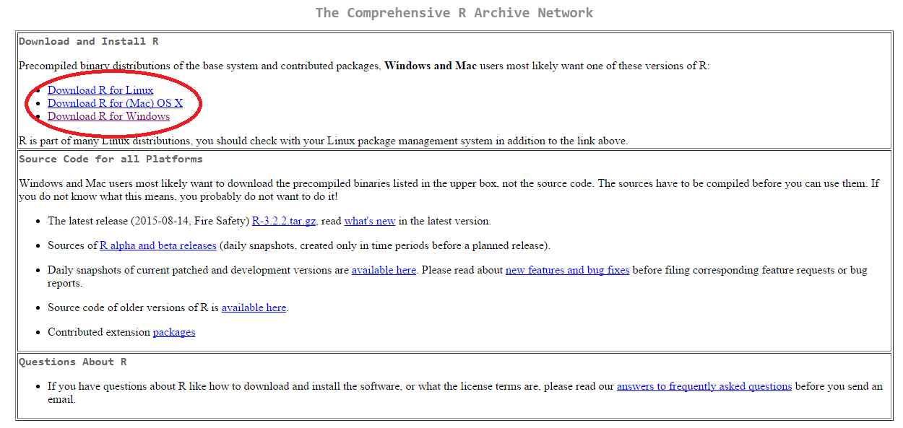

	3.
		a. If you're using windows: choose "install R for the first
		time." (We will cover the steps for Windows but not in detail
		for Mac or Linux)
		b. If you're using mac choose the package bases on the version
		of MacOS you are running and install the package using the
		package manager
		c. If you are using Linux then follow to the distribution you
		are running and follow the instruction on the pages.

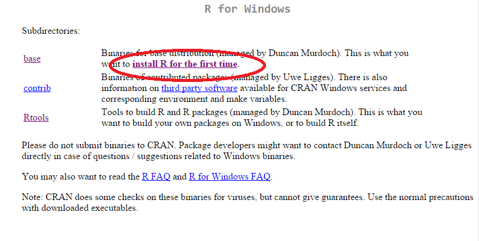

	4. Click Download R X.Y.Z for Windows

	5. When the download is complete Click the executable file to run
       the installer:

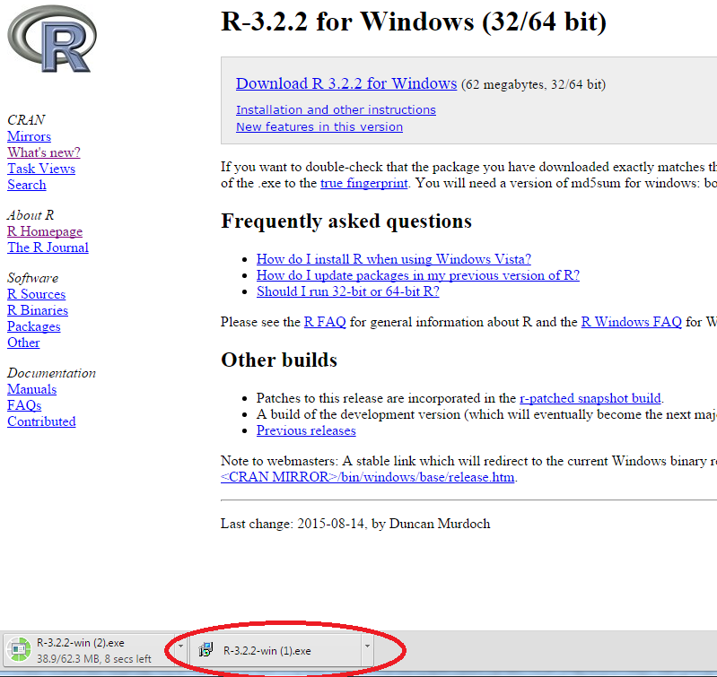

	6. You may need to confirm that you want to run the application:

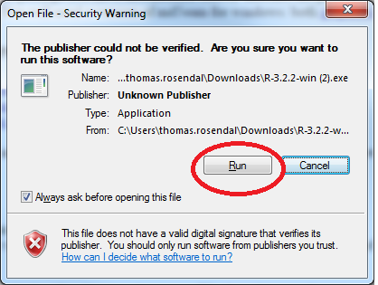

	7. Select English

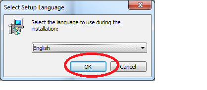

	8. Select Next We'll skip a few popups here. Just click 'next' each time.

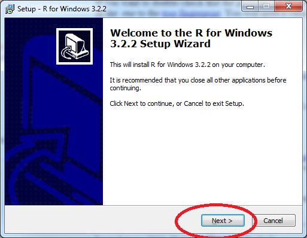

	9. When you get to this screen you may wish to select a custom
	place to put the R software but you can also just accept the
	default

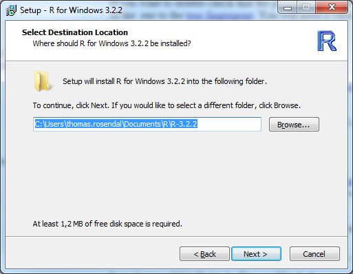

	10. Choose the 32-bit version (Like the following image)
        ....unless you know better

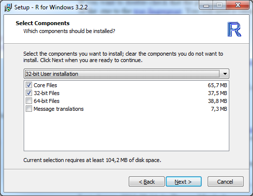

	11. Click next until you reach the end of the installation, Click Finish.

## Get and install R-Studio

	1. Go to [https://www.rstudio.com/products/rstudio/](https://www.rstudio.com/products/rstudio/)

	2. Click on 'Desktop'

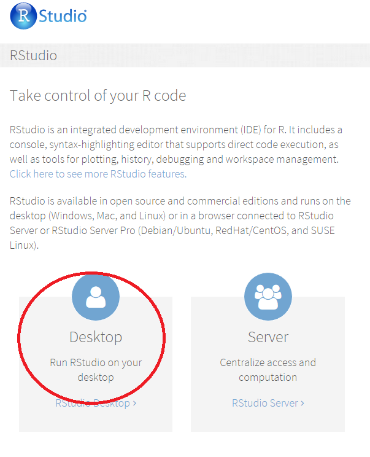

	3. Click on 'Download Rstudio Desktop'

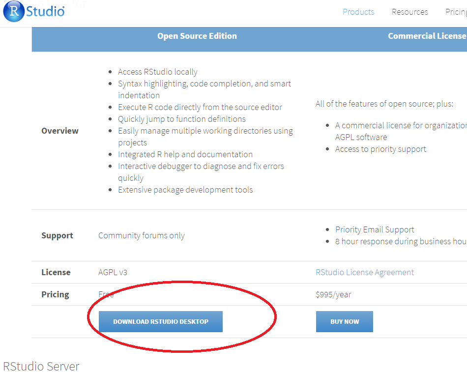

	4. Click on the version that corresponds to your operating
       system. We'll only cover the steps for Windows:

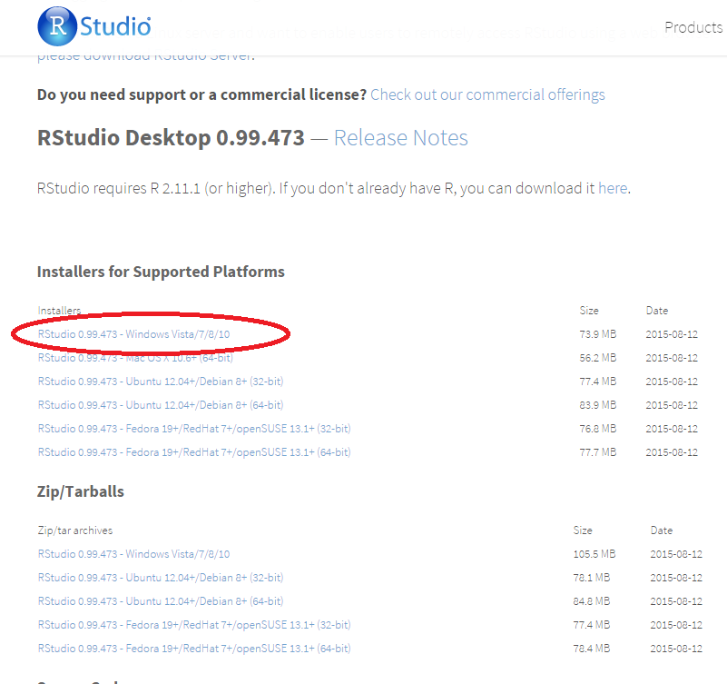

	5. Runs the installer

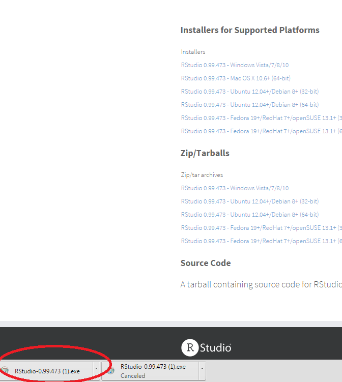

	6. Confirm:

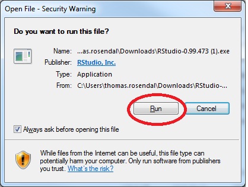

	7. Click next

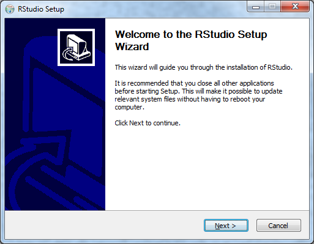

	8. Probably you should just leave the install location the default

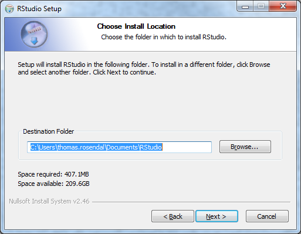

	9. Click install without changing anything

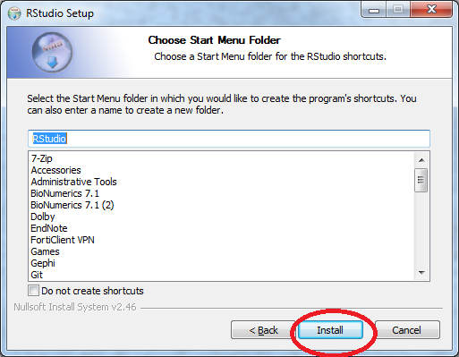

	10. Click Finish
