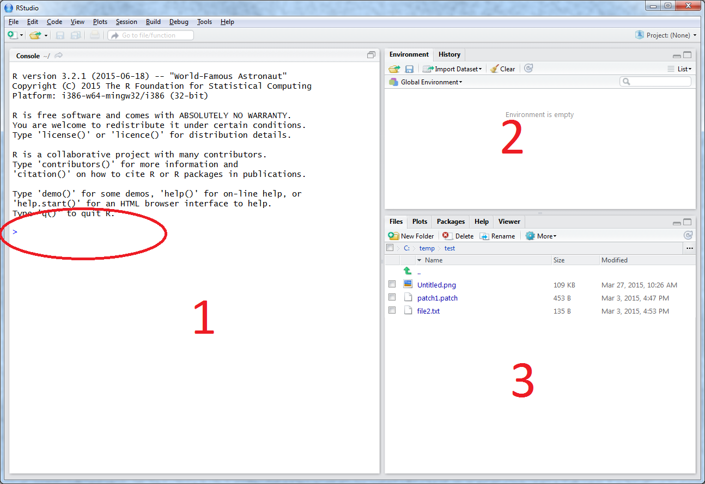
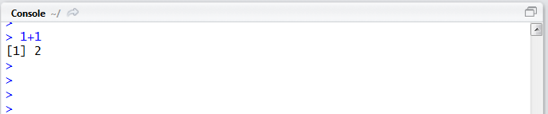
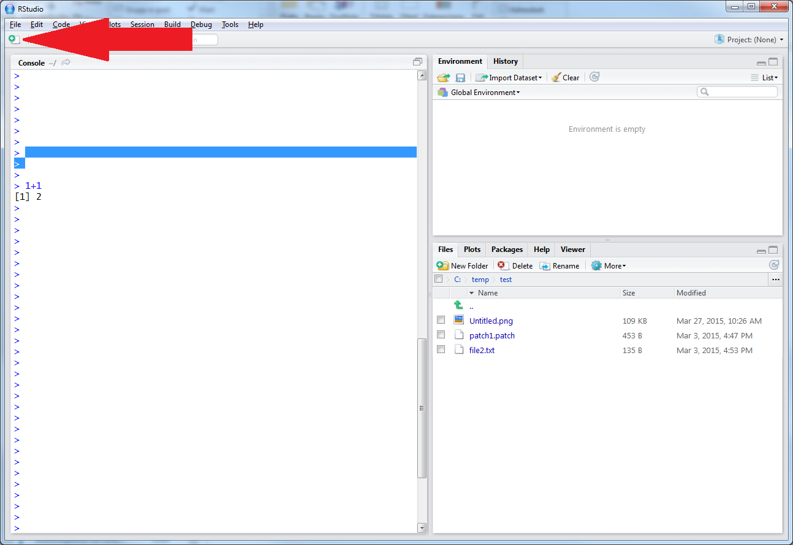
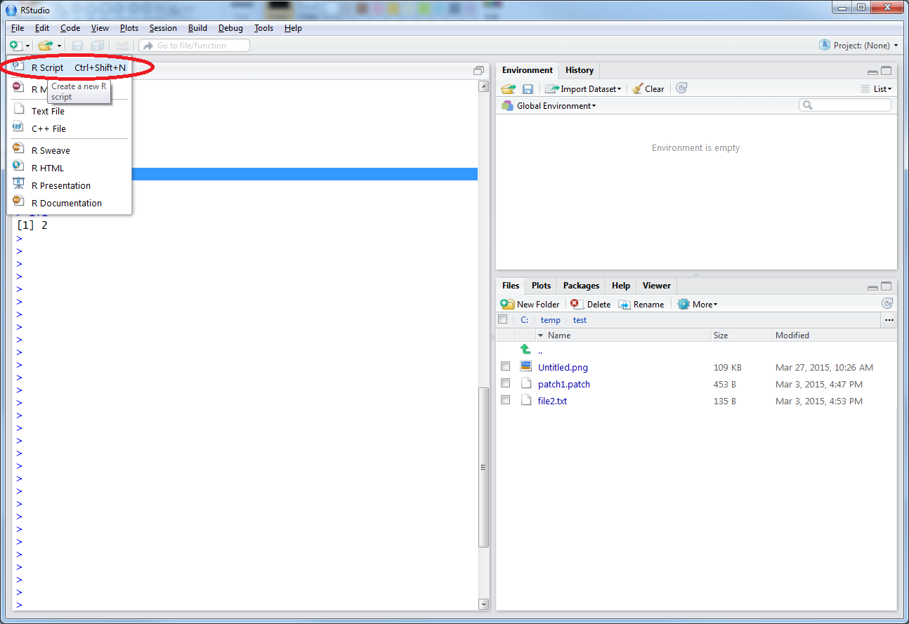
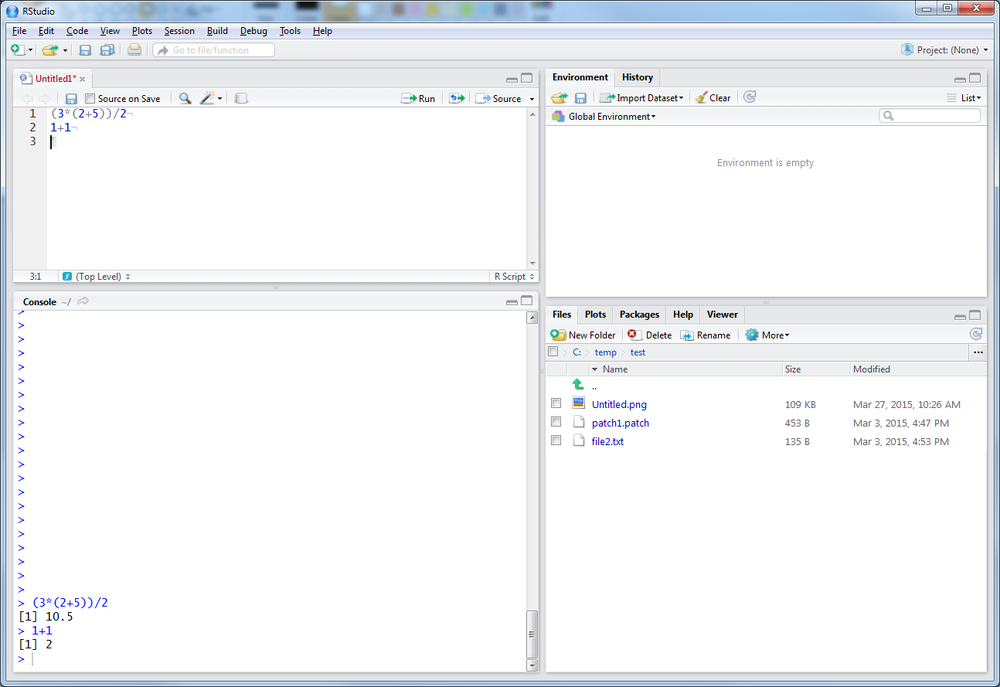
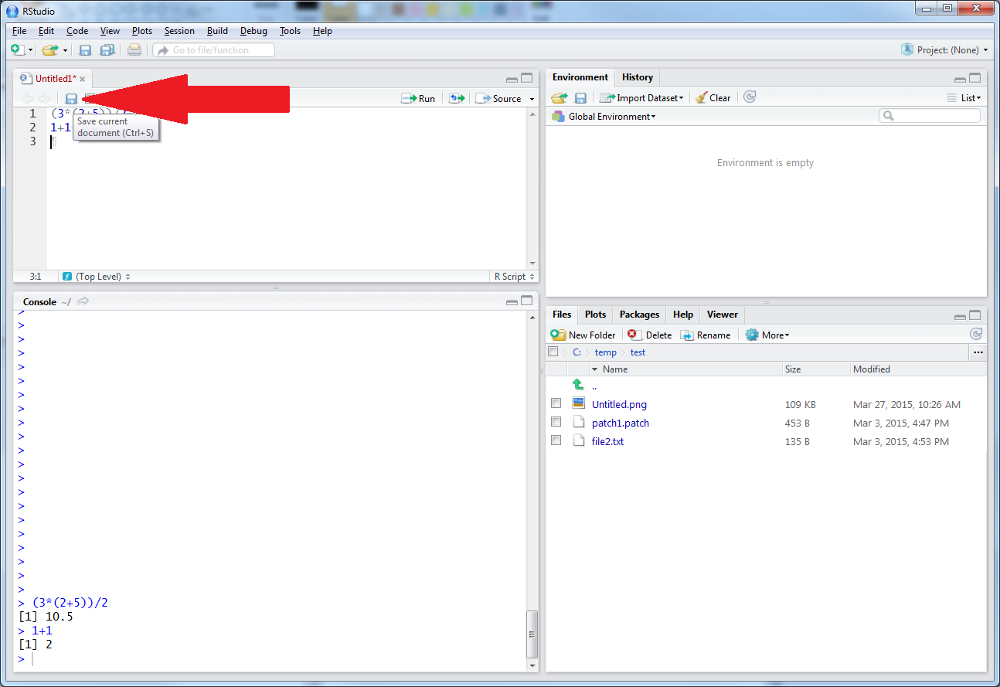

[](lesson1_1.html)
[](../../index.html)
[](lesson1_3.html)
[](./)

---

# How to enter commands in R

You can think of R like a statistical software package, a basic
calculator or a programming language. We will begin by treating like
it is a basic calculator. Let's open R-studio first to get comfortable
with the environment:

1. Start R-Studio from the start menu (Or however you do this in your
   operating system)

You'll see something like this:



The software is divided into 3 frames at first. Marked with a '1' is the
'R' Console. This is where you can enter commands that R will
interpret. You enter commands at the blue arrow that is circles in the
screen shot above. The area marked with a '2' tells you the objects
that are in your current environment (Don't worry about what this
means, we'll get back to this). The frame marked with a 3 is currently
just a file listing of the current working directory, there are also
other tabs that you can browse.

We will now just focus on the R-console and try entering some commands
and see what happens:

Let's treat R like it is a simple pocket calculator:



You type
```
1+1
```

And R returns to you the number '2'

Try some other simple arithmetic:

```{.R}
(3*(2+5))/2
```

You should get the answer: 10.5. You'll notice that R respects the
brackets that you placed in the expression and it follows the normal
rules of order of operations.

We can also execute commands with R from a Script file. This is way
that you probably most often will use R because it allows you to write
a sequence of operations that will be executed and you can come back
to later and repeat. If you are familiar with Stata or SAS then this
is analogous to .do files and .sas program files respectively. In R
these are text files with the extension '.R'. To
start a new R script file in R-Studio Click the 'new file button'



Then select R-Script from the drop down menu



Now we have a new script as a forth frame in R studio above the
Console frame.

We can type the same as before into this script frame and evaluate the
line that the cursor is currently on with the key sequence
Ctrl-Enter. Then you notice the console frame evaluates what you
wrote.



Now we have the beginning of an R-script; we just need to save it
somewhere. Click the save button in the script frame:



Then select the place you want to save your script. You can now load
this script and evaluate it at a later time.
