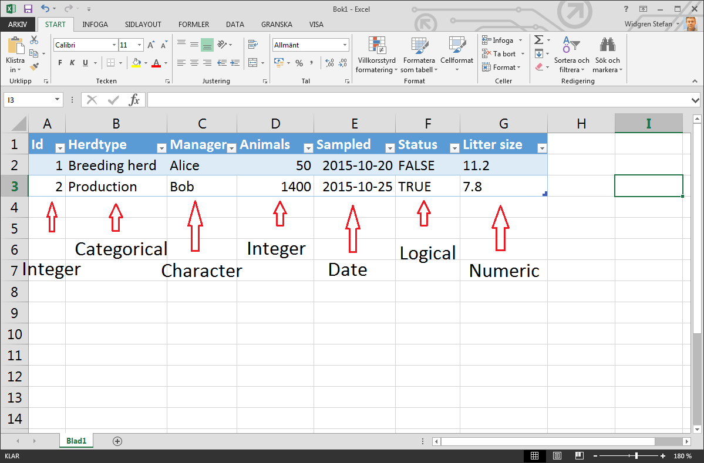

---
output:
    html_document:
        css: ../../style.css
---

---

# Data structures in R

This lesson will teach you

* What is a dataframe?
* What types of data can you store?

----

## What is a data.frame

The primary data structure of **R** is the
[data.frame](https://stat.ethz.ch/R-manual/R-patched/library/base/html/data.frame.html). A
`data.frame` is a table like data structure, compare with a Worksheet
in Excel. Each row contains values for each column. An important
feature of a table is that each column can have a different data type,
*e.g.* character, logical integer:

**Demonstrate how to read data from tools menu**

